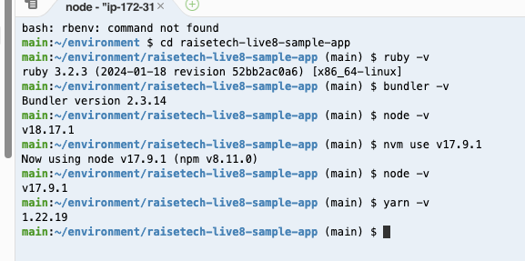
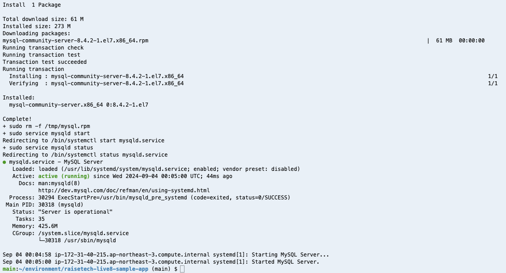
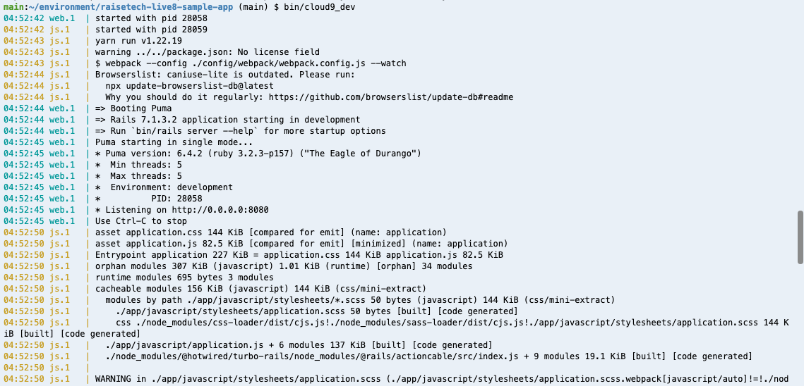
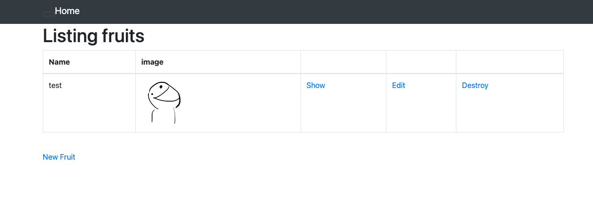

# 第3回講義感想

+ アプリケーションの起動準備や起動の操作に戸惑ったが、なんとか形にはできた。
+ 講義動画のように操作を実施できたが、細かいエラーについてまだ理解ができていない部分がある。
+ エラー等の対処として、一から操作を行っているため、時間がかかることもあった。
+ アプリケーションにて画像表示ができたが、自身でも画像表示ができた理由が理解できていない。
+ アプリケーションを起動していると、GitHubの手順について忘れているため、確認しながら作業を進めて定着を図りたい。

 1. APサーバーについて調べる

 + APサーバー名：Puma
 + APサーバーを終了させ、再アクセス不可を確認できました。

 2. DBサーバーについて調べる
 + DBサーバー名：MySQL
 + DBサーバーバージョン：8.4.2
 + サーバーを停止させ、再接続不可と確認できました。
 + 構成管理ツール名：Bundler
 

## エビデンス画像
### バージョン確認(rubyやbundlre等のバージョンについて確認を行った。)

### MySQLのインストールと起動確認（MySQLのインストールを実施し、正常な起動を確認した。）

### アプリケーションの起動確認（Pumaの起動を確認した。）

### ブラウザでアクセスを行った（ブラウザでアプリケーションにアクセスした。）

