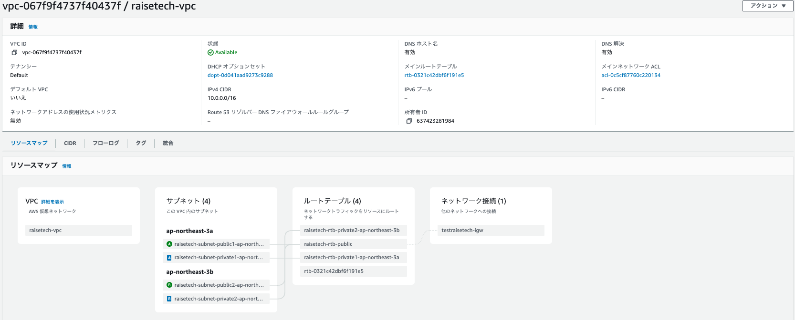
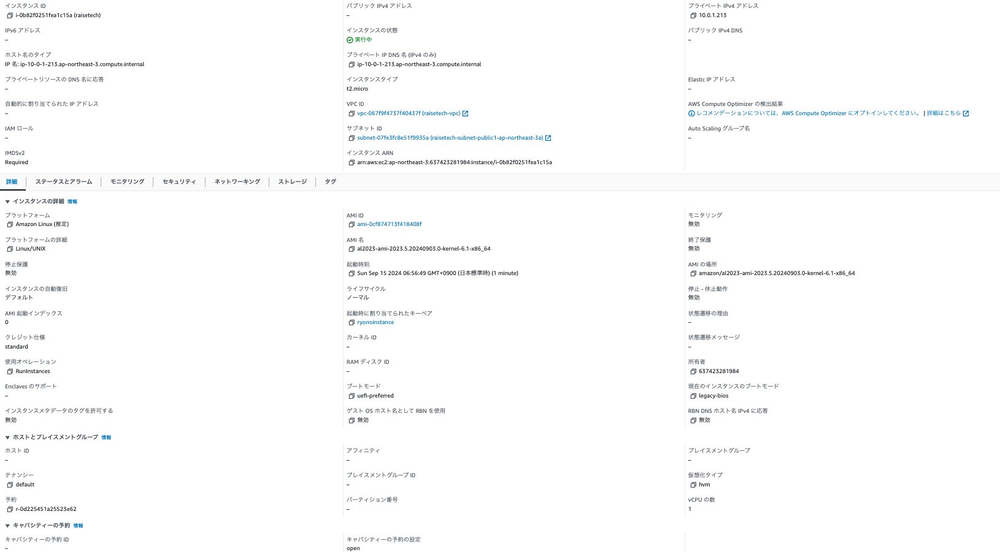
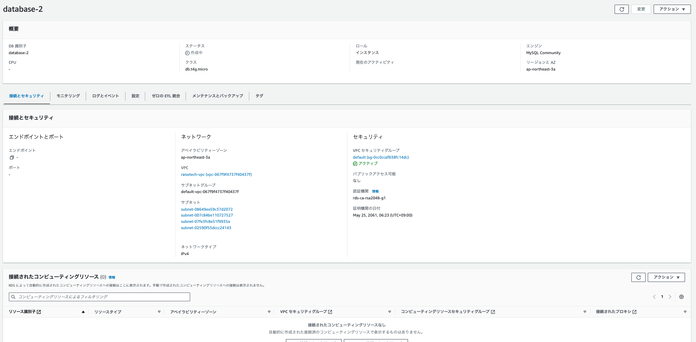
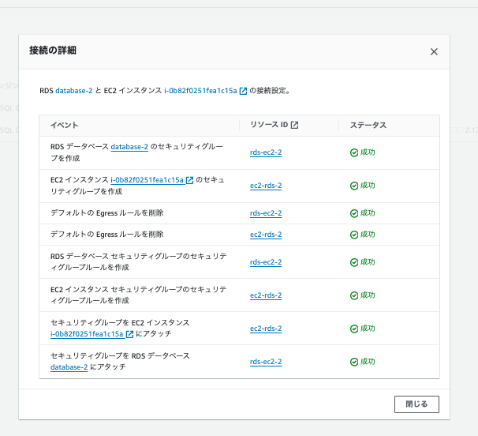
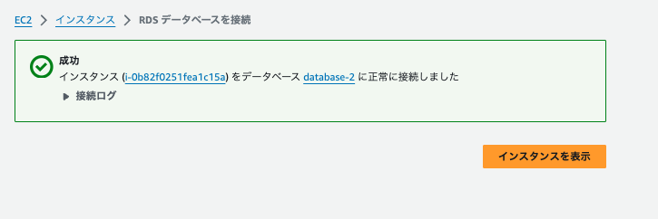
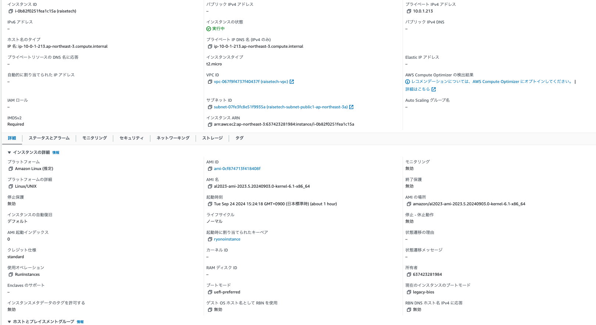
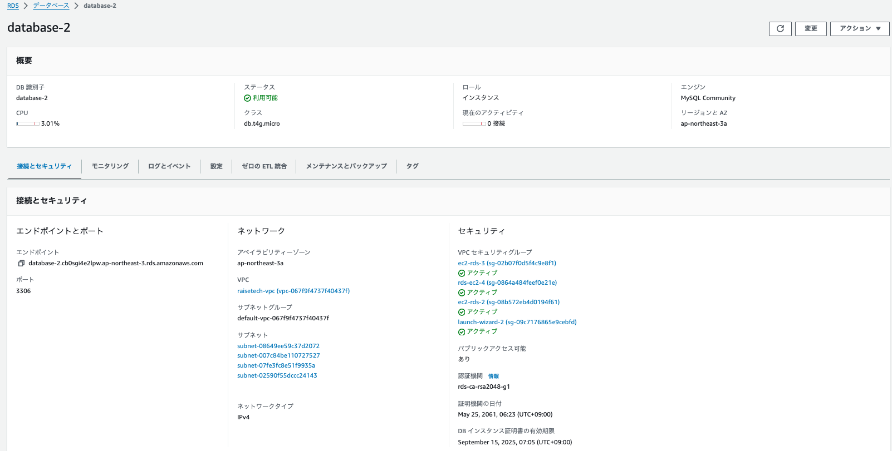
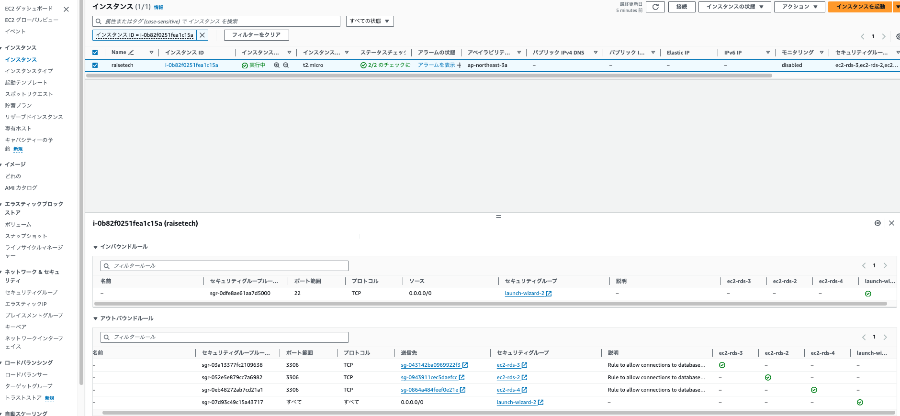
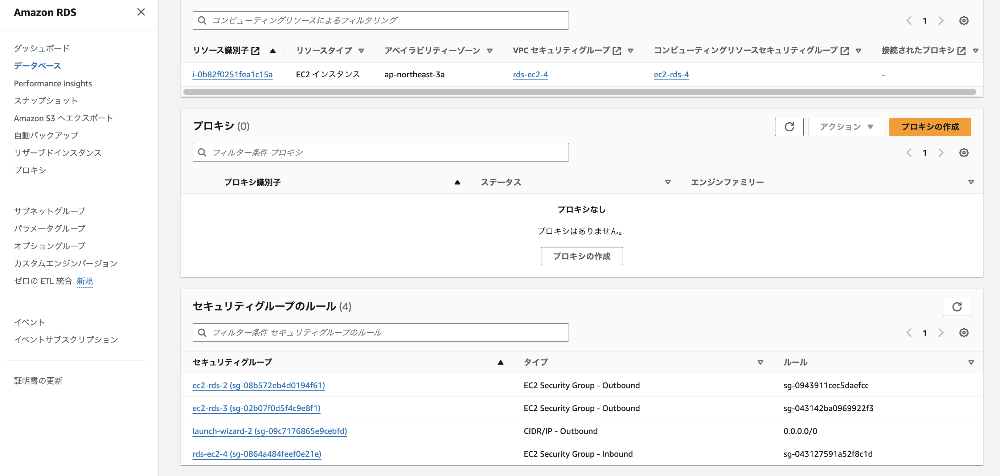

# lecture04の課題提出

### 新しいVPCの作成
+ AWS上に新しくVPCを作成した

### EC2の構築
+ raisetechインスタンスを構築した

### DSの構築
+ databece2を構築した

### EC2からRDSへ接続
+ raiseテクインスタンスとdatabece2を接続し、正常であることを確認した

##　以下再提出

###　EC2→RDSが実際に接続されているかの確認

###　セキュリティグループの追加を実施したため現状の詳細画像
+ EC2の詳細画像

+ DBの詳細画像

### セキュリティグループの追加変更を実施したためセキュリティグループ確認の画像
+ EC2のセキュリティグループのエビデンス画像

+ RDSのセキュリティグループのエビデンス画像

##　新しい画像の追加

### 新しいVPCの作成

### 新しいEC2の構築

### DSの構築

###　EC2→RDSが実際に接続されているかの確認
